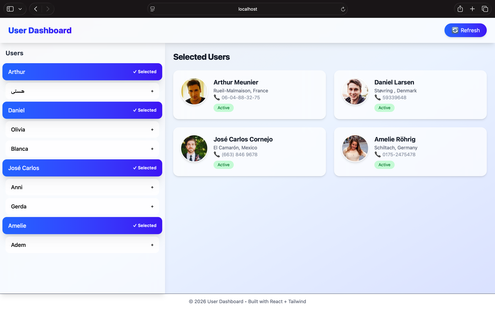

# 👤 User Dashboard

A modern **React + Tailwind CSS** based user dashboard that fetches and displays users from an API.
Users can be selected from a list and viewed in a detailed card layout.

---

## 🚀 Live Demo

👉 (Add your deployed link here after deployment)

---

## 📸 Screenshot



> 📌 Make sure to add a file named **screenshot.png** in your project root (or update the path if different)

---

## 🛠️ Tech Stack

* ⚛️ React (Vite)
* 🎨 Tailwind CSS
* 🌐 Random User API
* 💡 JavaScript (ES6+)

---

## 📂 Project Structure

```
src/
│
├── component/
│   ├── card/
│   │   ├── Card.jsx
│   │   └── HandleCard.jsx
│   └──ui
│      ├── Navbar.jsx
│      ├── Footer.jsx
│      └── NameButton.jsx
│
├── hooks/
│   └── useUsers.js
│
├── App.jsx
├── main.jsx
└── App.css
```

---

## 🧠 Concepts Covered

* Props & Props Destructuring
* Function as Props
* Passing Data via Props
* Array Rendering with `map()`
* Conditional Rendering
* React Hooks (`useState`, `useEffect`)
* Custom Hooks
* Component Reusability

---

## ⚙️ Installation & Setup

```bash
# Clone the repository
git clone https://github.com/ansfaiz/userDashboard

# Navigate to project folder
cd your-repo-name

# Install dependencies
npm install

# Run the app
npm run dev
```

--- 

## 🙌 Acknowledgements

* Random User API (https://randomuser.me/)
* Tailwind CSS
* React

---

## 👨‍💻 Author

Md Faiyaz Ansari
GitHub: https://github.com/ansfaiz

---

⭐ If you like this project, consider giving it a star!
